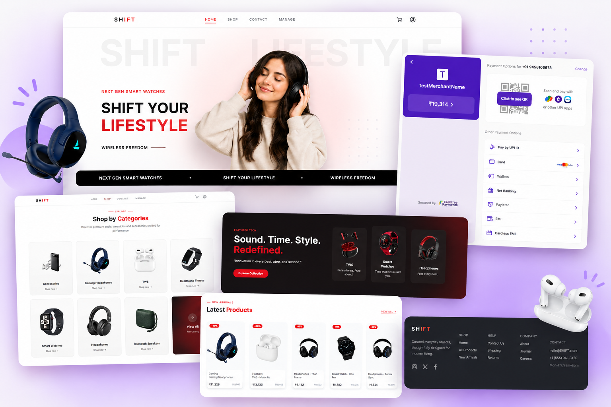
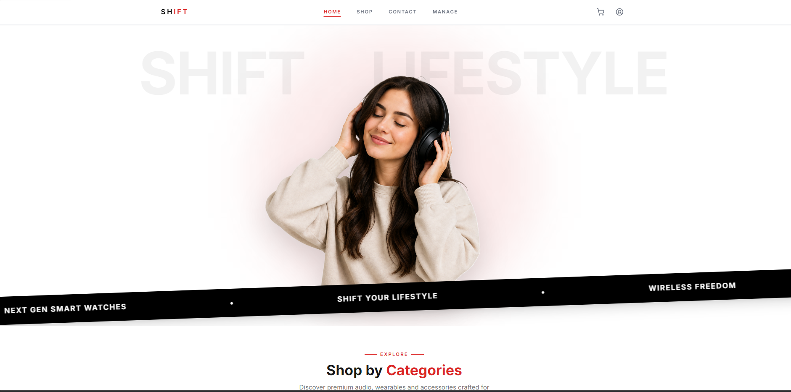
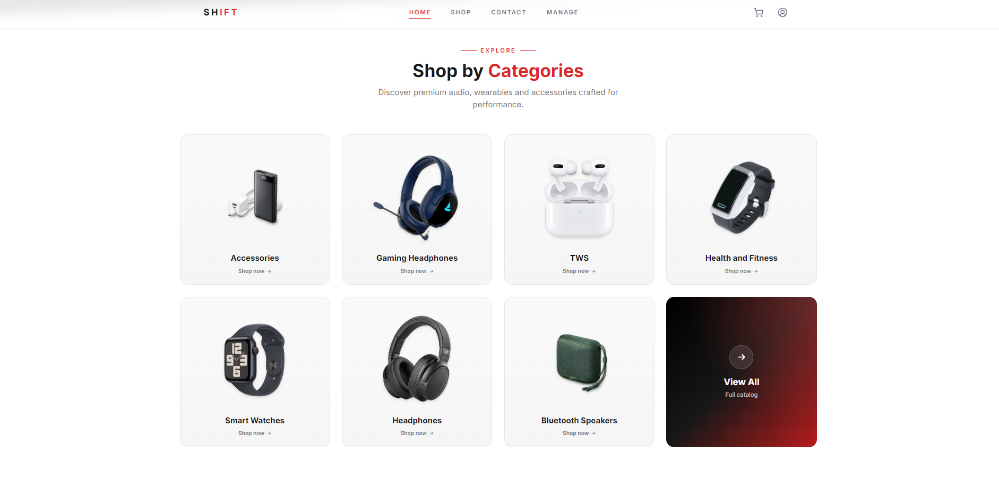
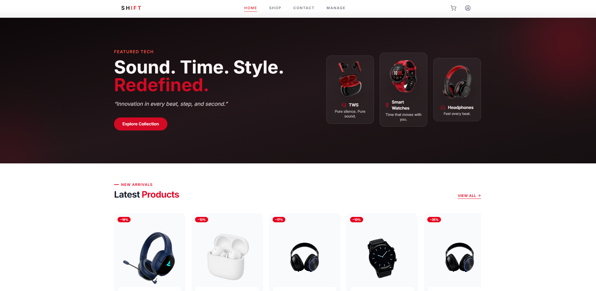
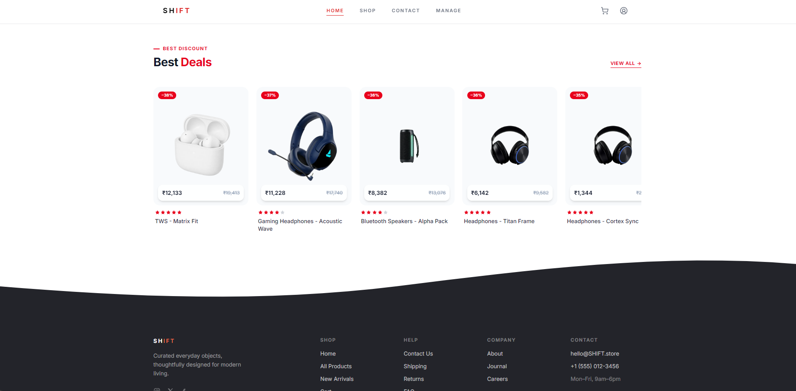
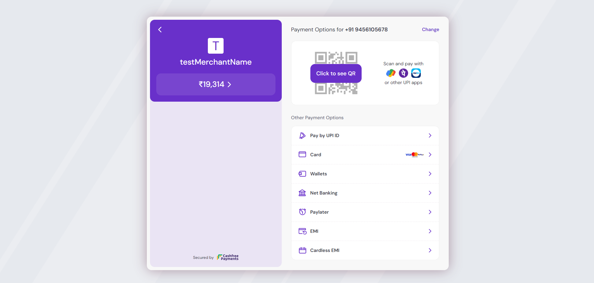

# 🛒 SHIFT E-commerce Platform

<p align="center">
  
</p>

A full-stack MERN e-commerce application that provides a secure online shopping experience with role-based access control, OTP authentication, online payments, and an admin dashboard for managing the platform.

---

## 🚀 Features

### Customer
* User registration and login
* OTP-based email verification
* JWT authentication
* Password reset via OTP
* Browse and search products
* Product categories
* Shopping cart
* Secure checkout
* Cashfree Sandbox payment integration
* Order history
* User profile management

### Admin
* Admin dashboard
* Manage products (Create, Read, Update, Delete)
* Manage orders
* Manage users
* Inventory management
* Protected admin routes using RBAC

---

## 📸 Application Screenshots

<table width="100%">
  <tr>
    <td width="50%" align="center">
      
      <br>
    </td>
    <td width="50%" align="center">
      
      <br>
    </td>
  </tr>
  <tr>
    <td width="50%" align="center">
      
      <br>
    </td>
    <td width="50%" align="center">
      
      <br>
    </td>
  </tr>
  <tr>
    <td colspan="2" align="center" width="100%">
      
      <br>
    </td>
  </tr>
</table>

---

## 🛠️ Tech Stack

### Frontend
* React
* React Router
* Tailwind CSS
* Axios

### Backend
* Node.js
* Express.js
* MongoDB
* Mongoose
* JWT Authentication
* Nodemailer (OTP Email Service)
* Cashfree Payment Gateway (Sandbox)

---

## 🔐 Authentication Flow

1. User Registration
2. Email OTP Verification
3. JWT Login
4. Protected Routes
5. Role-Based Access Control (Admin/User)
6. Forgot Password with OTP

---

## 💳 Payment Flow

1. Add products to cart
2. Proceed to checkout
3. Pay using Cashfree Sandbox (or COD)
4. Verify payment
5. Create order
6. View order history

---

## 🔑 Environment Variables

### Backend (`.env`)

```env
PORT=5000
MONGO_URI=your_mongodb_connection
JWT_SECRET=your_jwt_secret
EMAIL_USER=your_email
EMAIL_PASS=your_email_password
CASHFREE_APP_ID=your_app_id
CASHFREE_SECRET_KEY=your_secret_key